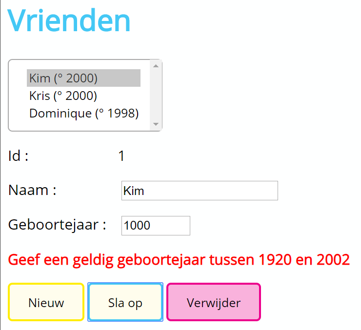

Een lijst van vrienden (array van objecten) tonen en bewerken

# Vrienden bewerken
In het bestand data.js vinden we een array met de gegevens van vrienden.
## Bij het opstarten
- Alle DOM-elementen worden gekoppeld
- De event handlers worden gekoppeld aan slcVrienden en btnSlaOp (zie verder)
- In slcVrienden worden de namen en leeftijden van de vrienden getoond. De hoogte van de listbox wordt ingesteld op basis van de lengte van de array vrienden
## Bij keuze voor een vriend
- De gegevens van de vriend worden opgehaald uit de array
- De gegevens van de gekozen vriend worden getoond in de controls
## Bij opslaan
- De gegevens van de geselecteerde vriend worden aangepast of de vriend wordt toegevoegd
- Geef een foutmelding als de input van het geboortejaar niet correct is
- De vernieuwde gegevens worden getoond.

